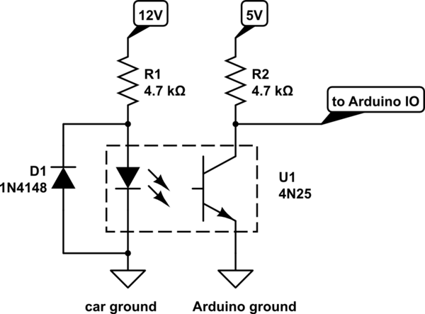

# bilge monitor

Code to monitor bilge pump activity via GPIO Input pin on raspberry Pi

# Circut

I started with this circuit:

which worked for 12.5v but not for 11.5v. putting two R1 resistors
in parallel made the circuit detect the 11.5v condition, need to dial
in the circuit... :-/
